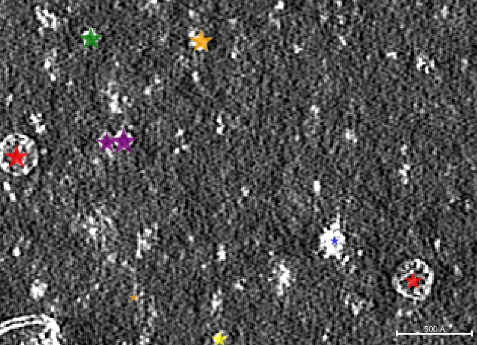
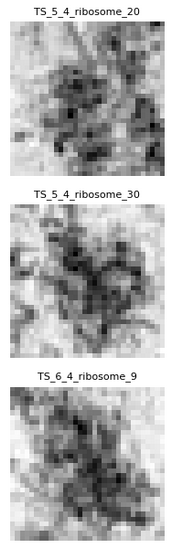
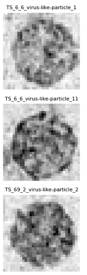
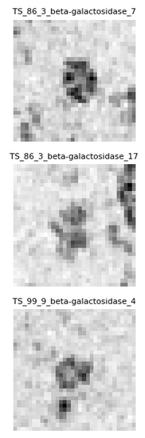
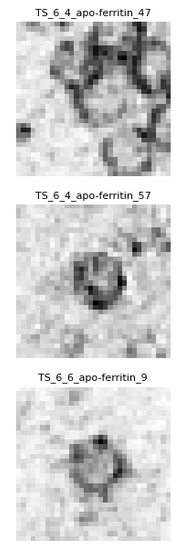
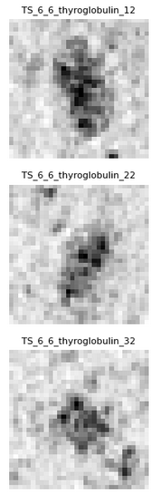
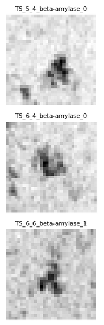
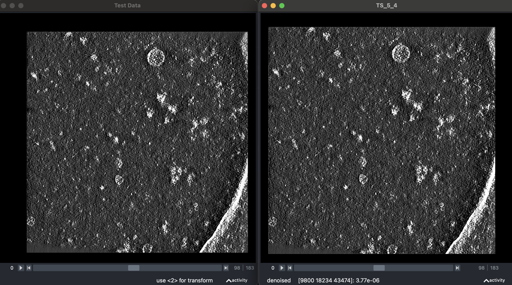
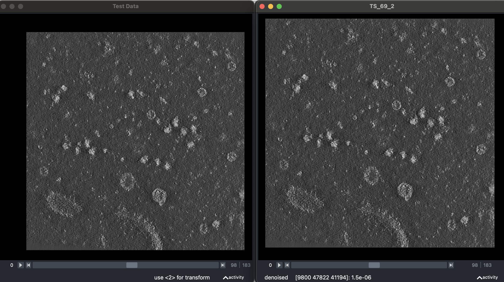

# CZII CryoET object identification Kaggle challenge

[Visit Challenge page](https://www.kaggle.com/competitions/czii-cryo-et-object-identification)

## Installation
```bash
# Clone repo
git clone git@github.com:edoumazane/cryoet.git
cd cryoet
cp environment_template.yaml environment.yaml # Edit the `environment.yaml` file variables with your local paths

# Create the environment `cryoet`
conda env create -f environment.yaml    # first time
conda env update -f environment.yaml    # each time you change something
conda remove -n cryoet --all            # if you want to start over

# Download the challenge data
conda activate cryoet
mkdir -p $DATA_DIR
cd $DATA_DIR
kaggle competitions download -c czii-cryo-et-object-identification
tar -xvf czii-cryo-et-object-identification.zip
du -hs .
# 17G  .
rm czii-cryo-et-object-identification.zip
du -hs .
# 9G  .

# If you use PyCharm, be aware that conda's environment variables are ignored
# However you can:
cp .env_template .env # Edit the `.env` file variables with your local paths

# For support in PyCharm's Runner
# Run / Edit configurations... / Edit configuration templates...
# And set Paths to .env files

# For support in PyCharm's Notebooks and PyCharm's Python console:
# run `import dotenv; dotenv.load_dotenv()` at the begin of each notebook...
```

## Data exploration
### Visualization of the challenge training set with `napari` viewer
`napari` is a handy tool to visualize 3D images and 3D points.

[Link to napari project GitHub repo](https://github.com/napari/napari/)

[Link to notebook](notebooks/1_napari_viz.ipynb)



### Matplotlib visualization of the challenge training set
[Link to notebook](notebooks/3_mpl_crops_viz.ipynb)

The table examplifies each particle type. Each image is a **Minimum Intensity Projection** along the z-axis of a 3D patch (32px x 32px x 32px), centered on the particle. *The edge and depth of the projection is 320 Å or 32 nm*. The size of a patch is 33 kpx. The size of one patch on disk is 131 kB (float32).

| ribosome| virus-like-particle| beta-galactosidase| apo-ferritin| thyroglobulin|beta-amylase|
|-|-|-|-|-|-|
|||||||


### Exploration
Dataset knowledge:
- nb of 3D images
- nb of particles per images
- shape of 3D images

Visualizations:
- napari
- matplotlib


### 2 experiments among 3 in the testing set are present in the training set





## Predictions
